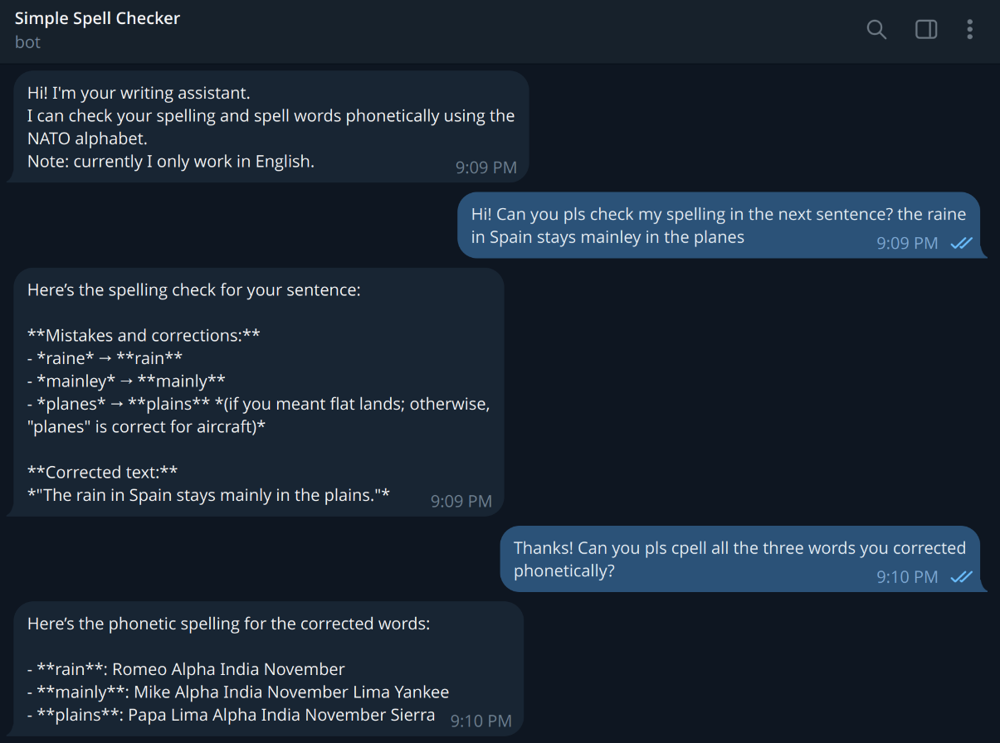
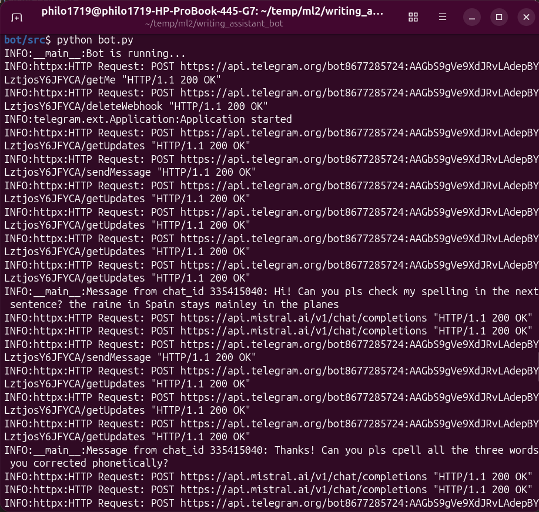

# Writing Assistant Bot

A Telegram bot that checks English spelling and spells words phonetically using the NATO alphabet, powered by Mistral AI and LangChain.
Live bot: `@ml2_spellchecker_bot` on Telegram

## Course Units Applied

- **U1 – Generative AI & LLMs**: Uses Mistral AI (`mistral-large-latest`) with the Mistral API (chosen for its reliability and free tier availability).
- **U2 – Prompt Engineering**: Structured system prompt with role definition, capabilities description, process description, format rules, and restrictions (including basic prompt injection defense).
- **U3 – Transformers & APIs**: Programmatic access to Mistral API using LangChain.
- **U4 – Agents & Automation**: LangGraph ReAct agent with (currently) two tools and per-user conversation memory, deployed as a Telegram bot.

## Architecture

-> User sends a message on Telegram ->
-> Telegram sends a POST request to the PythonAnywhere webhook URL ->
-> Flask receives it in `bot.py` ->
-> `invoke_agent()` is called with the message and the user's `chat_id` as `thread_id` ->
-> LangGraph ReAct agent decides which tool(s) to use ->
-> tool results are passed back to the model ->
-> final response is sent back to the user on Telegram.

Tools available to the agent:
- `check_spelling`: checks every lowercase word using `pyspellchecker`, returns mistakes with suggestions and a corrected version of the full text.
- `spell_phonetically`: spells any word or phrase letter by letter using the NATO phonetic alphabet.

## Technologies Used

- Python 3.12
- LangChain + LangGraph
- Mistral AI (`mistral-large-latest`)
- pyspellchecker
- python-telegram-bot
- PythonAnywhere (deployment, webhook with Flask)

## Installation & Configuration

1. Clone the repository
```bash
   git clone https://github.com/sophie1719/ml2-writing-assistant-bot.git
   cd ml2-writing-assistant-bot
```
2. Create a virtual environment and install dependencies:
```bash
   pip install -r requirements.txt
```
3. Copy `.env.example` to `.env` and fill in your API keys:
```bash
   cp .env.example .env
```

4. Obtain your API keys

  **Mistral API key**
  1. Go to [console.mistral.ai](https://console.mistral.ai)
  2. Create an account if you don't have one yet and go to API Keys
  3. Generate a new key and paste it as `MISTRAL_API_KEY` in your `.env`

  **Telegram bot token**
  1. Open Telegram and search for @BotFather
  2. Send `/newbot` and follow the prompts
  3. Copy the token BotFather gives you and paste it as `TELEGRAM_BOT_TOKEN` in your `.env`

## Usage

Start the bot:
```bash
cd src
python bot.py
```

Then open Telegram and find your bot. Example interactions:

- "Can you check my spelling? I recieved an intresting mesage today."
- "Spell 'Georgie' phonetically."
- "Check this and then spell the corrected words phonetically: the raine in
  Spain stays mainley in the planes."

## Screenshots / Demo





## Technical Decisions

- **Mistral over OpenAI/Gemini**: Gemini free tier keeps returning 429 errors during testing, and Mistral is reliable in this sense and free.
- **pyspellchecker**: offline, no API key needed, handles punctuation stripping automatically. I also decided to assume that all capitalized words are proper nouns and skip them in detection (names and toponyms are not present in pyspellchecker).
- **MemorySaver with chat_id as thread_id**: gives each Telegram user their own independent conversation memory without a database. Note: is in-memory only, so it resets every time the bot restarts and each user starts a fresh conversation after a restart.
- **Polling over webhooks**: simpler to set up for a course project and is enough for demo.

## Possible Improvements

- Add grammar and punctuation checking as separate tools.
- Add British/American English variant checker and rephraser.
- Add RAG-based style rules retrieval for more advanced writing suggestions.
- Improve proper noun detection beyond the capitalization heuristic.
- Persist conversation memory across bot restarts using a database-backed checkpointer.

## Author

Sofiya Sokolovskaya
